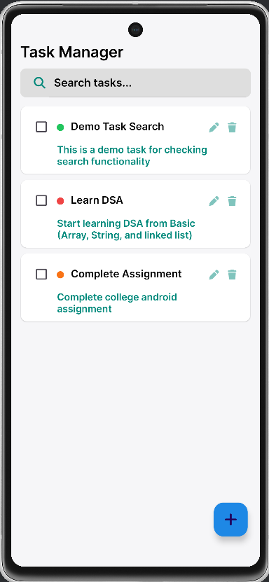
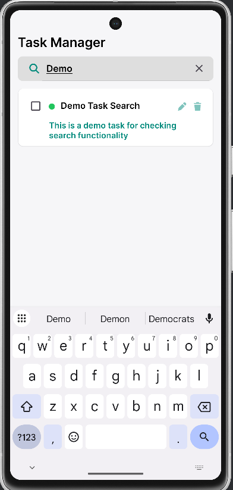
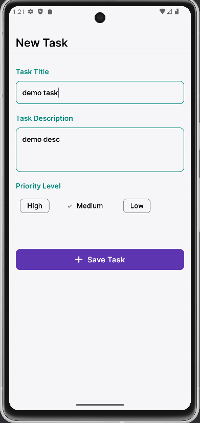
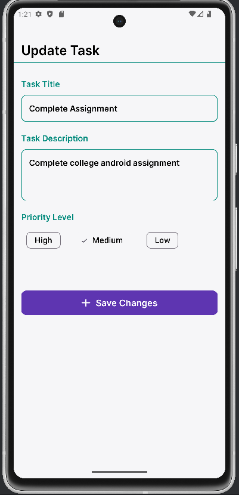
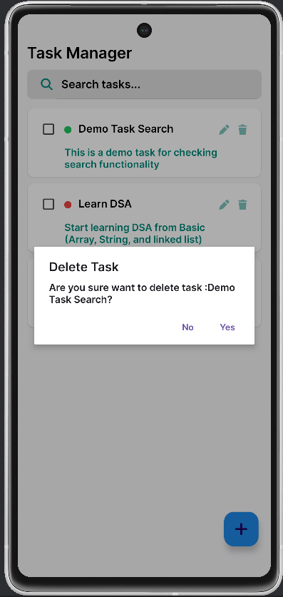

# Task Manager App - (Kotlin & Room) 📱
A simple Task Manager Application (To-Do like app) for add, update, and delete task and check task completed or not, using kotlin & room database

## ⚙️ Features:
- Add New Task
- Edit Existing Task
- Delete Task with alert dialog box
- Search Tasks By title / name
- Set Task priority (High/ Medium/ Low)
- Priority Indicator using Color Dot (red/ orange/ green)
- Stores Data locally using Room DB

## 🛠️ Tech Stack Used:
- XML Layout -> for UI and design of application
- Kotlin -> backend logic
- RecyclerView -> to show task list
- Room Database -> To Store Task data locally in device

## 📱 App screenshots:

