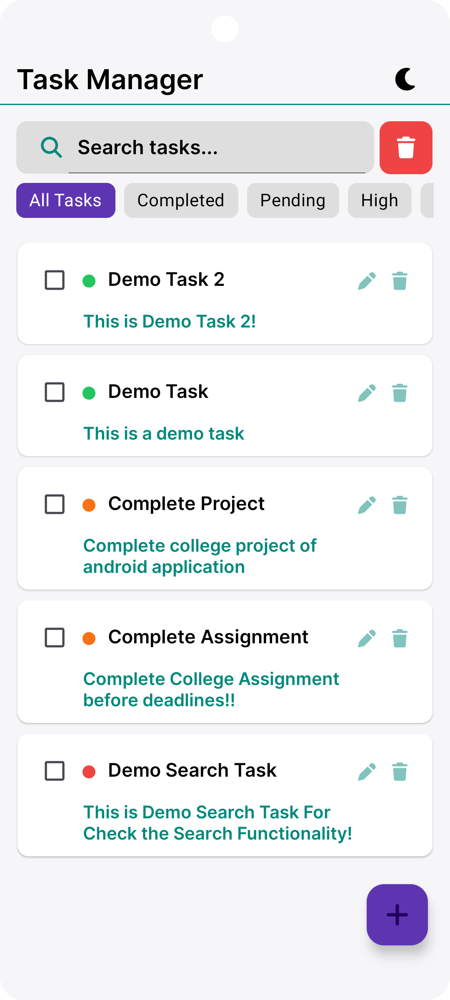
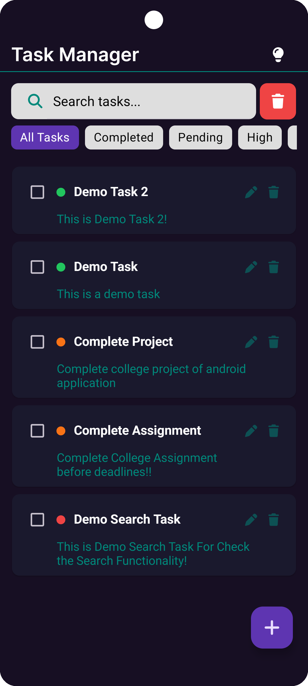
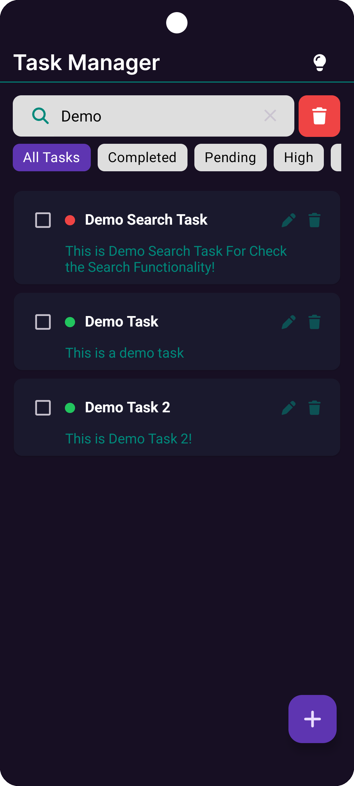
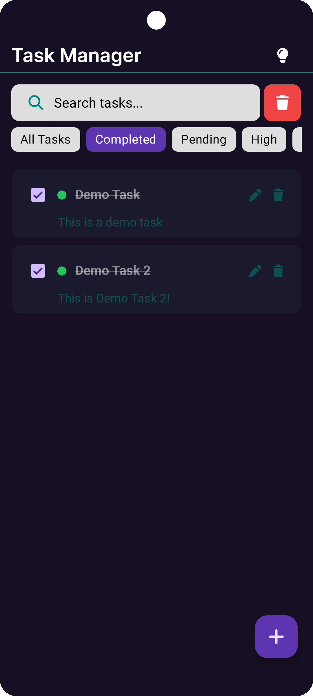
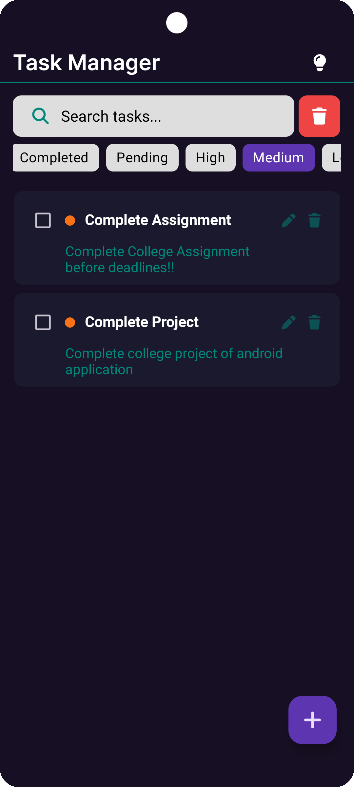
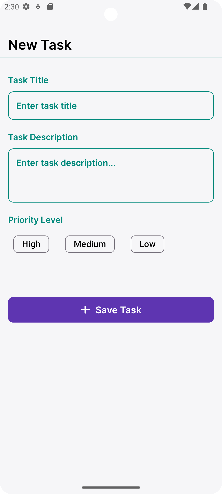
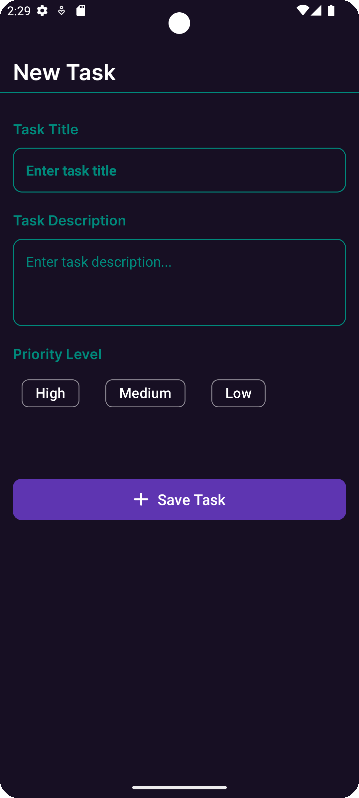
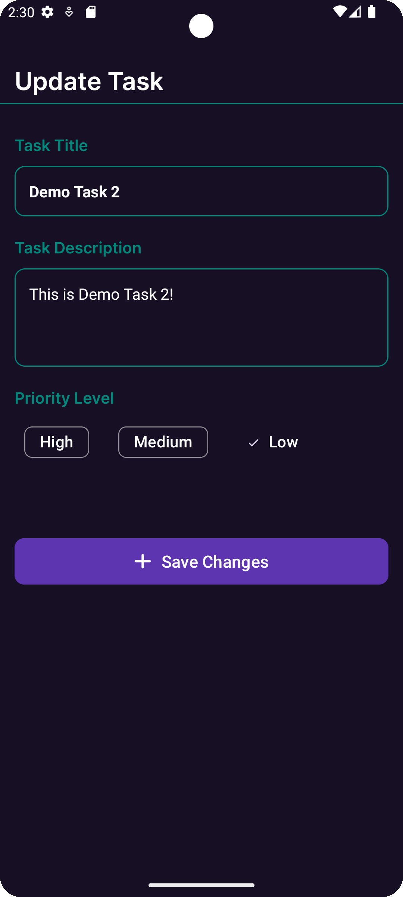

# Task Manager App - (Kotlin & Room) 📱
A Task Manager Application (To-Do like app) for add, update, and delete tasks and check task completed or not, made application using kotlin, room db

## ⚙️ Features:
- Add New Task
- Edit Existing Task
- Delete Task with alert dialog box
- Search Tasks By title 
- Set Task priority (High/ Medium/ Low)
- Filter Tasks by completed, pending and priority
- Delete All Tasks at once with alert dialog box!
- Theme Toggle (Dark / light Theme)
- Priority Indicator using Color Dot (red/ orange/ green)
- Stores Data locally using Room DB

## 🛠️ Tech Stack Used:
- XML Layout -> for UI and design of application
- Kotlin -> backend logic
- Room Database -> To Store Task data locally in device

## 📱 App screenshots:

    
    
  
